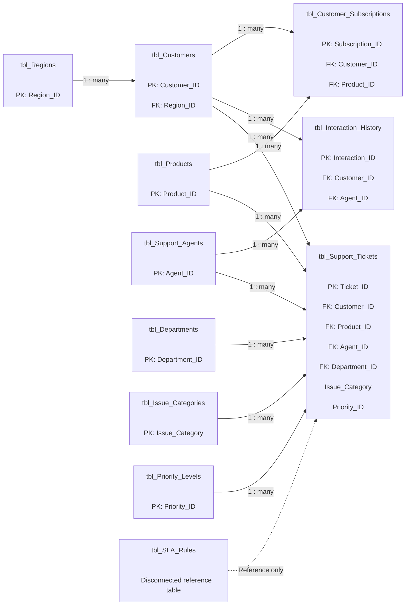

# NovaTech Customer Experience Analytics — Data Model

## Model Notes

- `tbl_Support_Tickets` is the primary transactional fact table.
- `tbl_Interaction_History` captures customer-agent interactions.
- `tbl_Customer_Subscriptions` acts as a bridge between customers and products.
- Dimension tables provide filtering by customer, product, agent, department, region, issue category, and priority.
- `tbl_SLA_Rules` remains disconnected because the support-ticket dataset does not contain an `SLA_ID` key.
- Relationships use one-to-many cardinality with single-direction filtering.