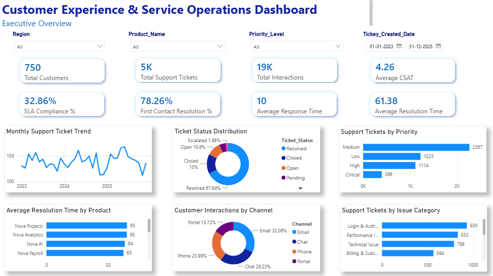
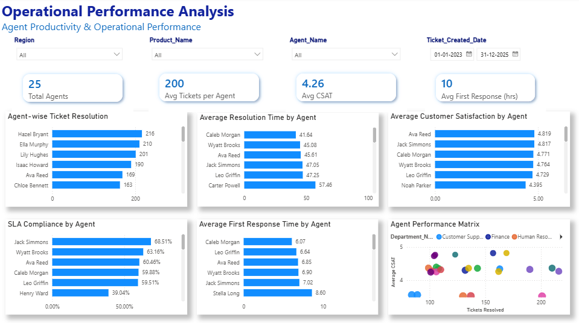
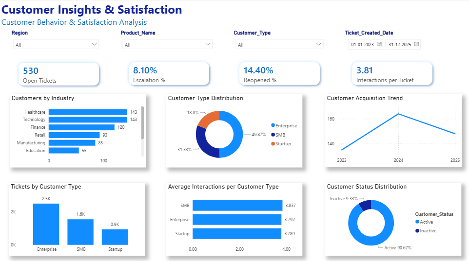
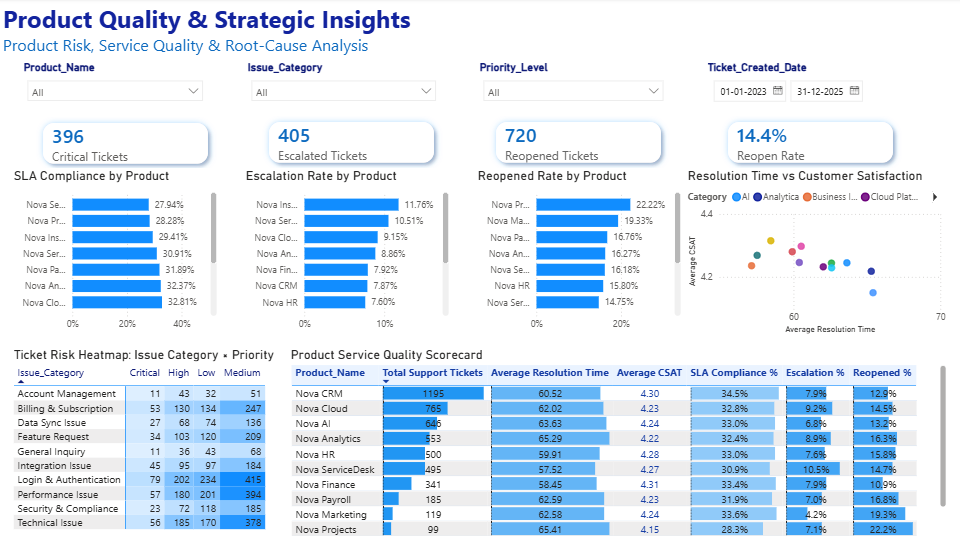

# 📊 NovaTech Customer Experience Analytics

## End-to-End Business Intelligence Case Study

---

## 📖 Project Overview

NovaTech Customer Experience Analytics is an end-to-end Business Intelligence project developed to simulate a real-world enterprise customer support environment.

The project demonstrates the complete analytics lifecycle—from business understanding and synthetic data generation to data modeling, KPI development, DAX calculations, dashboard design, and executive reporting.

Using interactive Power BI dashboards, the solution enables business leaders to monitor customer support operations, evaluate service quality, measure operational efficiency, identify product-specific risks, and make informed, data-driven decisions.

# 🎯 Business Problem

NovaTech Solutions is a fictional technology company managing thousands of customer support requests across multiple products, customer segments, and regions.

As support operations expanded, leadership faced several business challenges:

- Increasing support ticket volume
- Declining SLA compliance
- Longer ticket resolution times
- Rising ticket escalations
- Increasing ticket reopen rates
- Limited visibility into customer satisfaction
- Difficulty identifying high-risk products and recurring issue categories

The absence of a centralized reporting solution made it difficult for management to identify operational bottlenecks and prioritize improvement initiatives.

---

# 🎯 Project Objectives

The primary objective of this project was to design an interactive Business Intelligence solution capable of transforming raw operational data into meaningful business insights.

The dashboards were developed to:

- Monitor customer support performance
- Track customer satisfaction (CSAT)
- Measure SLA compliance
- Analyze ticket trends
- Evaluate support agent performance
- Identify high-risk products
- Monitor customer behavior
- Improve first-contact resolution
- Reduce ticket reopen rates
- Support executive decision-making
---

# ❓ Business Questions Answered

This Business Intelligence solution was designed to answer critical operational and strategic questions, including:

### Executive Reporting
- How many support tickets are received over time?
- What is the current customer satisfaction (CSAT) score?
- Are SLA commitments being achieved?
- How efficiently are support teams resolving customer issues?

### Operational Performance
- Which support agents handle the highest ticket volumes?
- Which agents consistently achieve higher customer satisfaction?
- What is the average response and resolution time?
- Which teams require operational improvement?

### Customer Insights
- Which customer segments generate the highest support demand?
- Which industries require the most support?
- How has customer acquisition changed over time?
- What customer groups experience the highest interaction volume?

### Product Quality & Risk Analysis
- Which products generate the highest number of escalations?
- Which products experience the highest ticket reopen rates?
- Which issue categories contribute most to operational risk?
- Which products require immediate business attention?
---

# 🛠️ Technology Stack

| Technology | Purpose |
|------------|----------|
| **Power BI** | Interactive dashboard development & business reporting |
| **DAX** | KPI calculations and business metrics |
| **Python** | Synthetic dataset generation using Faker |
| **SQL** | Data querying and business analysis *(SQL scripts will be added in the next phase)* |
| **Microsoft Excel** | Data validation and preprocessing |
| **Git & GitHub** | Version control and portfolio publishing |
---

# 🏗️ Project Architecture

```mermaid
flowchart LR
    A[Business Problem<br/>and Requirements]
    B[Python Synthetic<br/>Data Generation]
    C[Excel Validation<br/>and Data Preparation]
    D[Power BI Data<br/>Transformation]
    E[Star Schema<br/>Data Modeling]
    F[DAX Measures<br/>and KPI Development]
    G[Four Interactive<br/>Power BI Dashboards]
    H[Business Insights<br/>and Recommendations]
    I[GitHub Portfolio<br/>and Documentation]

    A --> B
    B --> C
    C --> D
    D --> E
    E --> F
    F --> G
    G --> H
    H --> I
```

The solution follows an end-to-end analytics workflow, beginning with business requirements and progressing through synthetic data generation, validation, modeling, KPI development, dashboard creation, and strategic reporting.

# 📈 Dashboard Overview

The project consists of four interactive dashboards designed for different business stakeholders.

## 📊 Dashboard 1 – Executive Overview

### 🎯 Purpose

Provides executive leadership with a comprehensive view of customer support operations, enabling real-time monitoring of service performance, customer satisfaction, and operational efficiency.

### 📌 Key KPIs

- Total Customers
- Total Support Tickets
- SLA Compliance
- Customer Satisfaction (CSAT)
- Average Resolution Time
- First Contact Resolution

### 📈 Business Value

This dashboard helps leadership monitor operational performance, identify emerging support trends, and quickly detect service bottlenecks requiring attention.

## 👨‍💼 Dashboard 2 – Operational Performance Analysis

### 🎯 Purpose

Evaluates support team productivity by measuring agent performance, response efficiency, resolution effectiveness, and customer satisfaction.

### 📌 Key KPIs

- Average Tickets per Agent
- Average Resolution Time
- First Response Time
- SLA Compliance
- Customer Satisfaction (CSAT)

### 📈 Business Value

Enables managers to identify top-performing agents, optimize workload distribution, and improve operational efficiency through data-driven performance monitoring.

---

## 😊 Dashboard 3 – Customer Insights & Satisfaction

### 🎯 Purpose

Analyzes customer behavior, interaction patterns, customer segmentation, acquisition trends, and overall satisfaction levels.

### 📌 Key KPIs

- Open Tickets
- Escalation Rate
- Reopened Tickets
- Interactions per Ticket

### 📈 Business Value

Supports customer-centric decision-making by identifying high-demand customer segments, improving engagement strategies, and monitoring satisfaction trends.

---

## 🚀 Dashboard 4 – Product Quality & Strategic Insights

### 🎯 Purpose

Evaluates product performance by analyzing service quality, ticket escalations, SLA compliance, reopen rates, and issue category trends.

### 📌 Key KPIs

- Critical Tickets
- Escalated Tickets
- Reopened Tickets
- Reopen Rate
- Product-wise SLA Compliance
- Product-wise CSAT

### 📈 Business Value

Helps leadership identify high-risk products, prioritize quality improvements, reduce customer escalations, and strengthen long-term product reliability.

---

# 📌 Key Performance Indicators

| KPI | Business Purpose |
|---|---|
| **Total Support Tickets** | Measures overall customer-support demand |
| **SLA Compliance %** | Tracks adherence to agreed service commitments |
| **Average Resolution Time** | Measures how quickly customer issues are resolved |
| **Average First Response Time** | Evaluates the speed of initial customer support |
| **Average CSAT** | Measures customer satisfaction with support outcomes |
| **First Contact Resolution %** | Tracks issues resolved during the first interaction |
| **Escalation %** | Identifies cases requiring higher-level intervention |
| **Reopened %** | Measures the effectiveness of the initial resolution |
| **Interactions per Ticket** | Evaluates the effort required to resolve each issue |
| **Tickets per Agent** | Supports workload and productivity analysis |
---

# 💡 Key Business Insights

- NovaTech processed **5,000 support tickets** across its customer-support operations.
- Overall **SLA compliance was approximately 32.9%**, indicating a substantial gap against expected service-performance levels.
- Customer satisfaction remained comparatively strong, with an overall **average CSAT of approximately 4.26 out of 5**.
- The overall **ticket reopen rate was 14.4%**, suggesting opportunities to improve first-time resolution quality.
- Approximately **8.1% of tickets were escalated**, demonstrating a need to strengthen frontline issue resolution and product-support expertise.
- Enterprise customers generated the largest share of ticket demand, followed by SMB and startup customers.
- Customer acquisition increased from 2023 to 2024 before declining during 2025.
- Product-level analysis showed meaningful differences in SLA compliance, escalation rates, reopen rates, and resolution times.
- Higher-volume issue categories—including login and authentication, performance, and billing-related issues—represent strong candidates for root-cause reduction initiatives.
- Agent-level differences in ticket handling, CSAT, response time, and resolution time indicate opportunities for targeted coaching and workload balancing.
---

# 🚀 Business Recommendations

1. **Prioritize SLA recovery initiatives**  
   Investigate the causes of delayed response and resolution, establish product-specific SLA monitoring, and introduce early-warning alerts for at-risk tickets.

2. **Improve first-contact resolution**  
   Develop stronger troubleshooting guides, knowledge-base articles, and agent training for recurring issue categories.

3. **Target high-reopen products**  
   Conduct root-cause analysis on products with elevated reopen rates and involve product-development teams in permanent corrective actions.

4. **Reduce avoidable escalations**  
   Review escalation reasons and strengthen frontline agent authority, technical knowledge, and access to resolution resources.

5. **Balance agent workloads**  
   Use ticket volumes, resolution time, SLA performance, and CSAT together when allocating cases and identifying coaching needs.

6. **Automate recurring support issues**  
   Introduce self-service workflows, guided troubleshooting, and automated responses for frequently occurring login, billing, and product-access issues.

7. **Strengthen customer-segment strategies**  
   Design differentiated support models for Enterprise, SMB, and Startup customers based on their volume and interaction patterns.

8. **Establish continuous product-quality reviews**  
   Share product-level ticket, escalation, and reopen trends with engineering and product-management teams through recurring service-quality reviews.

